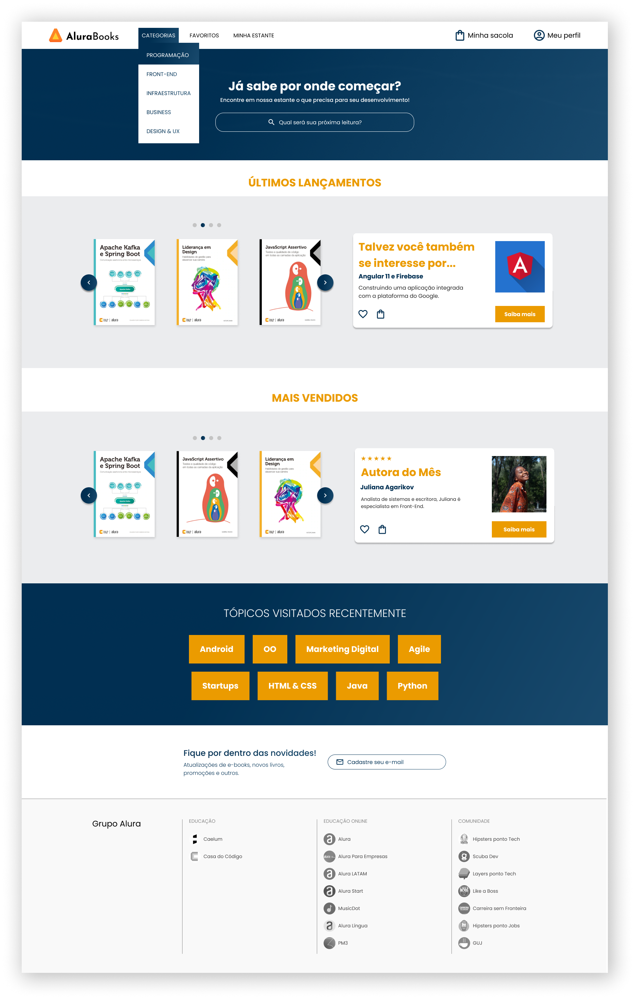

<h1 align="center"> Projeto Alura Books </h1>

  <a href="#-tecnologias">Tecnologias</a>&nbsp;&nbsp;&nbsp;|&nbsp;&nbsp;&nbsp;
  <a href="#-projeto">Projeto</a>&nbsp;&nbsp;&nbsp;|&nbsp;&nbsp;&nbsp;
  <a href="#-layout">Layout</a>&nbsp;&nbsp;&nbsp;|&nbsp;&nbsp;&nbsp;
  <a href="#memo-licença">Licença</a>

  

 

  

## 🚀 Tecnologias

Esse projeto foi desenvolvido com as seguintes tecnologias:

- HTML e CSS
- Figma

## 💻 Projeto

O Projeto Alura Books, é um site desenvolvido para comprar livros.

Esse exemplo foi usado como exemplo de desenvolvimento, durante o curso de responsividade mobile first da Alura.

- [Assistir aulas Alura](https://www.alura.com.br)

## 🔖 Layout

Você pode visualizar o layout do projeto utilizado no curso online através [DESSE LINK](https://www.figma.com).

## :memo: Licença

Esse projeto está sob a licença MIT.
